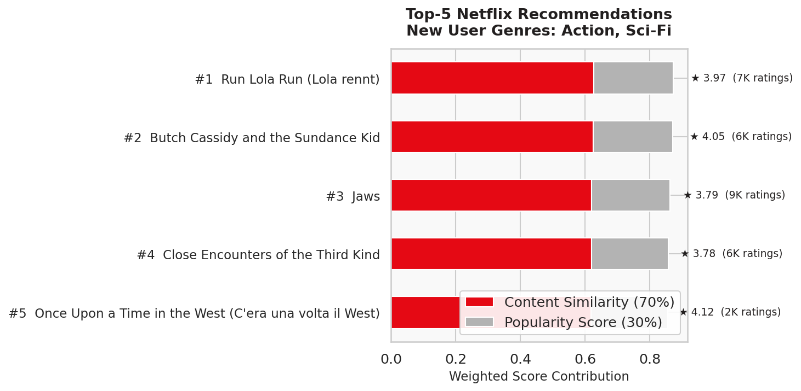
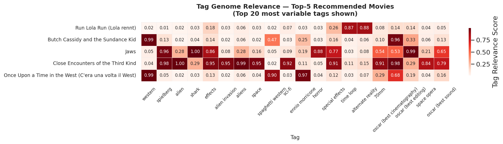

# New Users recieve personalized suggestions with answer to only one question - Netflix recommends 5 movies you will love

## The cold start problem is an issue which has plagued streaming services for years. Platforms, like Netflix, need to ensure engagment of new users who add to revenue. Netflix has cracked the code on recommendations using the MovieLens dataset and can now recommend new users 5 movies they are going to love. 

## New users have limited prior history on their shows, watch time, and typical viewing patterns. Netflix needs to recommend the new users something they will love from the start or risk losing the business. There are lots of other streaming platforms who will take the new user in and attempt to satisfy them. Additionally, the model created must not be a simple popularity recommendation as the user wants something personalized to them. There is no way to know for sure that the user will like what is trending and it might do the opposite and turn them off from the platform. 

## Using the MovieLens dataset we attempt to recommend 5 shows to a new user based off a limited genre interest survey and millions of ratings from other viewers. The combination of these two approaches enables us to ensure the new user is satisfied with the platform. Within the Movielens dataset the movies are classified by genre and each have a rating from another user. This provides insights, a way to claissfy the movie and then historical background on what people emjoyed about it. Each movie is has tag which further describe elements of the movies which could indicate a user would like it more. The bar chart ranks the top-5 movies recommended to a new user who selected Action and Sci-Fi, with each bar split between content similarity (red, 70%) and popularity (gray, 30%). Which shows the model is reasoning about taste, not just picking blockbusters. Notably, Once Upon a Time in the West scores lowest overall despite having the highest average rating (4.12 stars), because its tag genome is a weaker match to the Action/Sci-Fi profile than the top four entries. The heatmap explains exactly why: each film has a dramatically different content fingerprint across the 20 most discriminating tags. Jaws and Close Encounters of the Third Kind both score high on "spielberg" and "special effects," but Jaws dominates on "shark" and "horror" while Close Encounters dominates on "alien," "space," and "alternate reality" — the kind of distinction that genre labels alone could never capture. Together, the two charts demonstrate the core logic of the model: genre is a starting point, not an answer, and it is the combination of tag genome similarity and community ratings that allows the platform to deliver a genuinely personalized list to someone it has never seen before.

